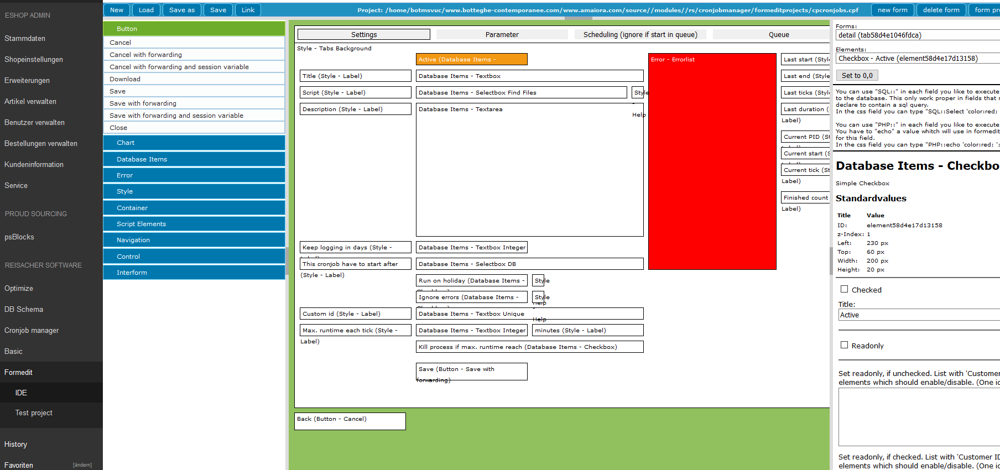
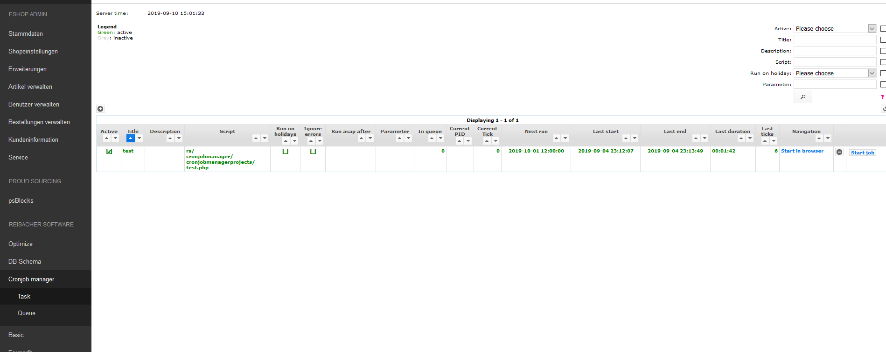
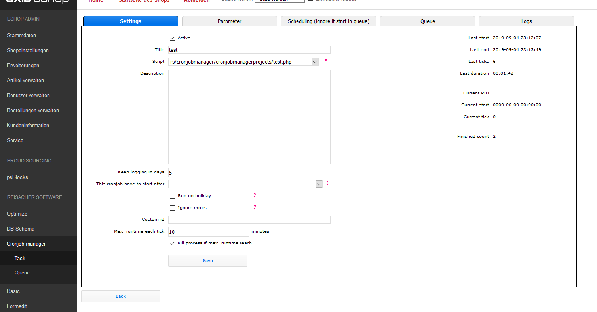

# Oxid formedit (beta)

## Description

Build your admin views with drag and drop.

Module was created for Oxid 6.x

### IDE

### Results

## Install

1. Copy files into following directory

        source/modules/rs/formedit
    
2. Add to composer.json at shop root
  
        "autoload": {
            "psr-4": {
                "rs\\formedit\\": "./source/modules/rs/formedit"
            }
        },

3. Install dependencies

        composer require mustangostang/spyc --no-update
        composer update --no-plugins --no-scripts --no-dev --ignore-platform-reqs

4. Refresh autoloader files with composer in the oxid root directory.

        composer dump-autoload

5. Modifications

Modify following file:

    out/admin/src/oxid.js
    
Search for function **changeEditBar**. Copy following snippet on the top of the function.

    /* cpformedit start */
    var input = document.createElement("input");
    input.setAttribute("type", "hidden");
    input.setAttribute("name", "rs_formedit_sPos");
    input.setAttribute("value", sPos);
    top.basefrm.edit.document.getElementById( "transfer" ).appendChild(input);

    var sNode="";
    var aInput = top.basefrm.list.document.getElementById( "search" ).getElementsByTagName('input');
    if(aInput && aInput.length > 0)
    {
        for(x=0;x<aInput.length;x++)
        {
            if(aInput[x].name=="cl")
            {
                sNode=aInput[x].value;
            }
        }
    }
    var input = document.createElement("input");
    input.setAttribute("type", "hidden");
    input.setAttribute("name", "rs_formedit_sNode");
    input.setAttribute("value", sNode);
    top.basefrm.edit.document.getElementById( "transfer" ).appendChild(input);
    /* cpformedit end */

6. Security

Please add a .htaccess/.htpasswd to the oxid admin and copy the .htaccess to the folder:

    rs/formedit/formedit

to prevent access the backend views from outside of the oxid admin area.

## How to use

You can add formedit projects to all modules from this shop.
Create a folder 

    formeditprojects
     
within the modules.

You can extend the menu.xml of the module to call the project.

## Example "menu.xml"

    <?xml version="1.0" encoding="ISO-8859-15"?>
    <OX>
        <OXMENU id="NAVIGATION_ESHOPADMIN">
            <MAINMENU id="mxmanageprod">
                <SUBMENU id="mxarticles" cl="article" list="article_list">
                    <!--
                    attribute
                    cl = rs_formedit_halfpage|rs_formedit_fullpage|rs_formedit_fullpage_lang
                        rs_formedit_halfpage = like the bottom part of the article view
                        rs_formedit_fullpage = a fullpage view
                        rs_formedit_fullpage_lang = a fullpage view with language select box
                    clparam = combination from parameters seprated with &amp;
                        parameter:
                        project=path within the module folder to the projectfile (example: project=cpoxshop/cpformedit/oxshop.cpf)
                        optional: navi= in which mode should the formeid start. values=NEW|EDIT. default=NEW
                        optional: index1value=unique identifier what should load at the beginning. if you want load data directly (parameter navi must set to EDIT) Only on cpformedit_fullpage|cpformedit_fullpage_lang
                        optional: useindex=index1value|index2value. Default: index1. Normally in a tab the oxid from a article,user... is set into the index1value parameter, but if you like to build a n:m relation it have to start with index2value. navi have to set to NEW. Only on cpformedit_halfpage
                    -->
                    <TAB id="tbclcpformedit_article" cl="rs_formedit_halfpage" clparam="project=MODULEFOLDER/cpformedit/oxarticles.cpf" />
                </SUBMENU>
            </MAINMENU>
        </OXMENU>
    </OX>
    
## Other featues

* You can extend the formedit views by php files to implement new validations
* You can develop your own controls for easy reuse
* ...